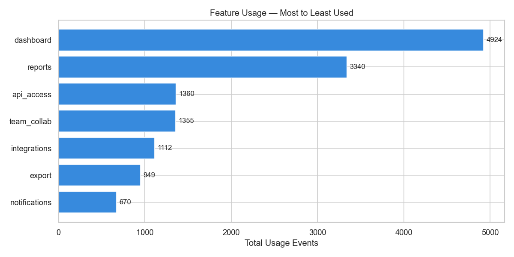
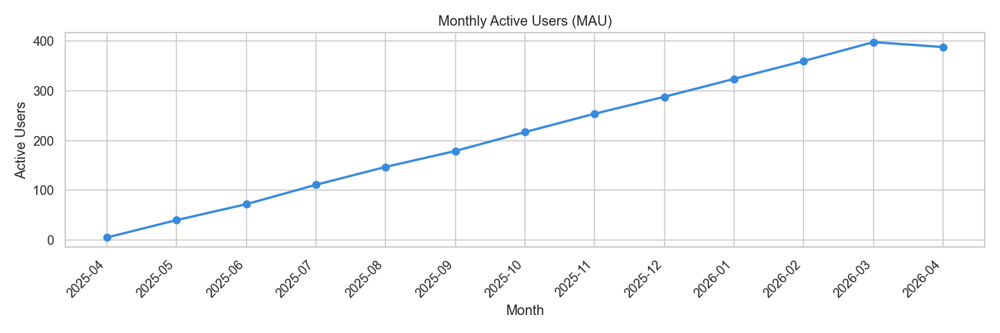
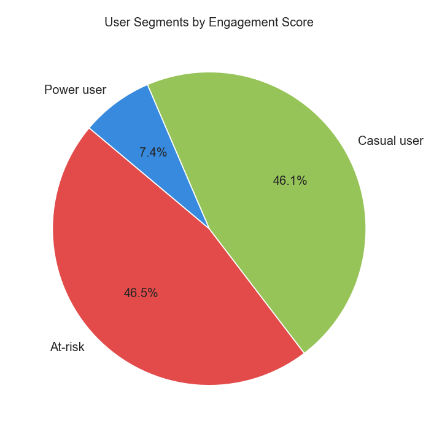
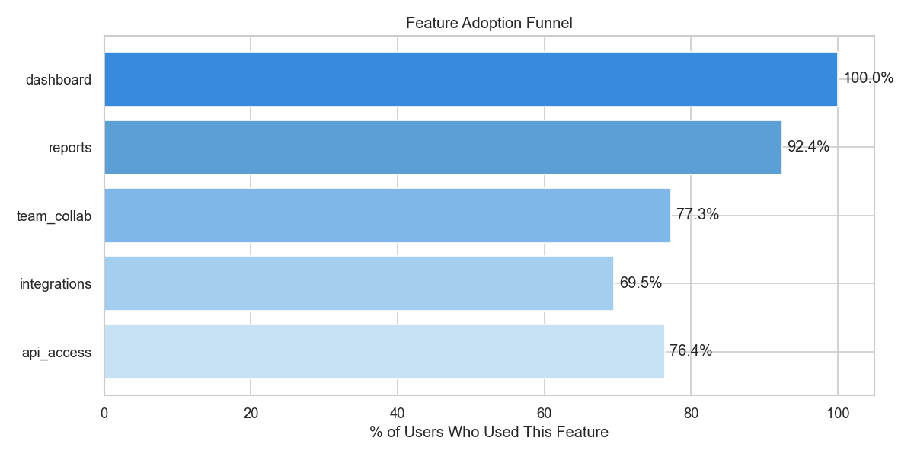
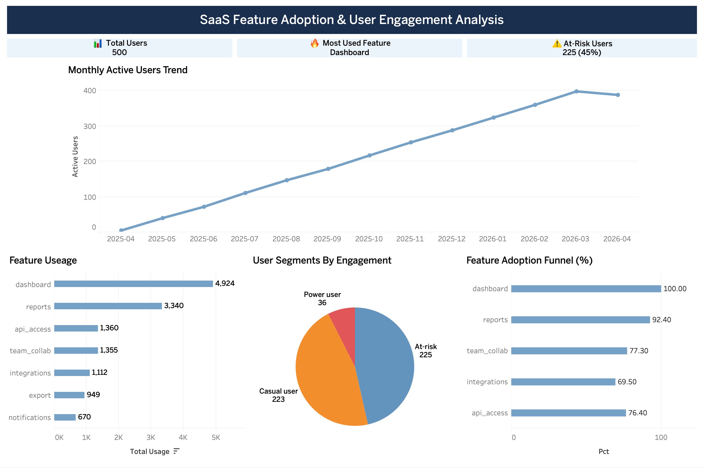

# SaaS Feature Adoption & User Engagement Analysis

**Tools:** Python · SQL · Tableau · pandas · seaborn  
**Dataset:** Synthetic · 500 users

---

## Overview

This project works through the kind of analysis a product team at a SaaS company runs regularly. Which features are people actually using? Where are users dropping off? Who is at risk of churning?

I generated a synthetic dataset modelled on real product event data, ran SQL queries to answer specific business questions, built an engagement scoring model in Python, and brought everything together in a Tableau dashboard.

---

## Key Findings

**Dashboard and Reports drive 67% of all activity.**  
Users are coming to the product primarily for reporting. Advanced features like Integrations and API Access see significantly lower engagement.

**User growth accelerated 40x over 12 months.**  
Monthly active users grew from 9 in April 2025 to 390 by March 2026, with growth picking up sharply from October onward.

**45% of users are at risk of churning.**  
Only 36 users qualify as power users. The product is heavily reliant on a small highly engaged segment while the majority sit dangerously close to inactive.

**Adoption drops off after Reports.**  
Dashboard sits at 100% adoption and Reports at 92%, but there is a clear drop at Team Collaboration (77%) and Integrations (69%).

---

## Dashboard

[View live on Tableau Public](https://public.tableau.com/views/Book1_17773223961290/Dashboard1?:language=en-GB&:sid=&:redirect=auth&:display_count=n&:origin=viz_share_link)

---

## Recommendations

**Re-engage at-risk users.** An automated nudge after 14 days of inactivity could convert a meaningful share of the 225 at-risk users back into active ones at zero acquisition cost.

**Investigate the Integrations drop-off.** A 30 point gap between Reports and Integrations adoption points to either a discoverability problem or a complexity barrier worth a quick usability test.

**Build a power user programme.** 36 power users is a small but highly valuable segment. Creating a feedback loop with them would give the product team much better signal on what is working.

---

